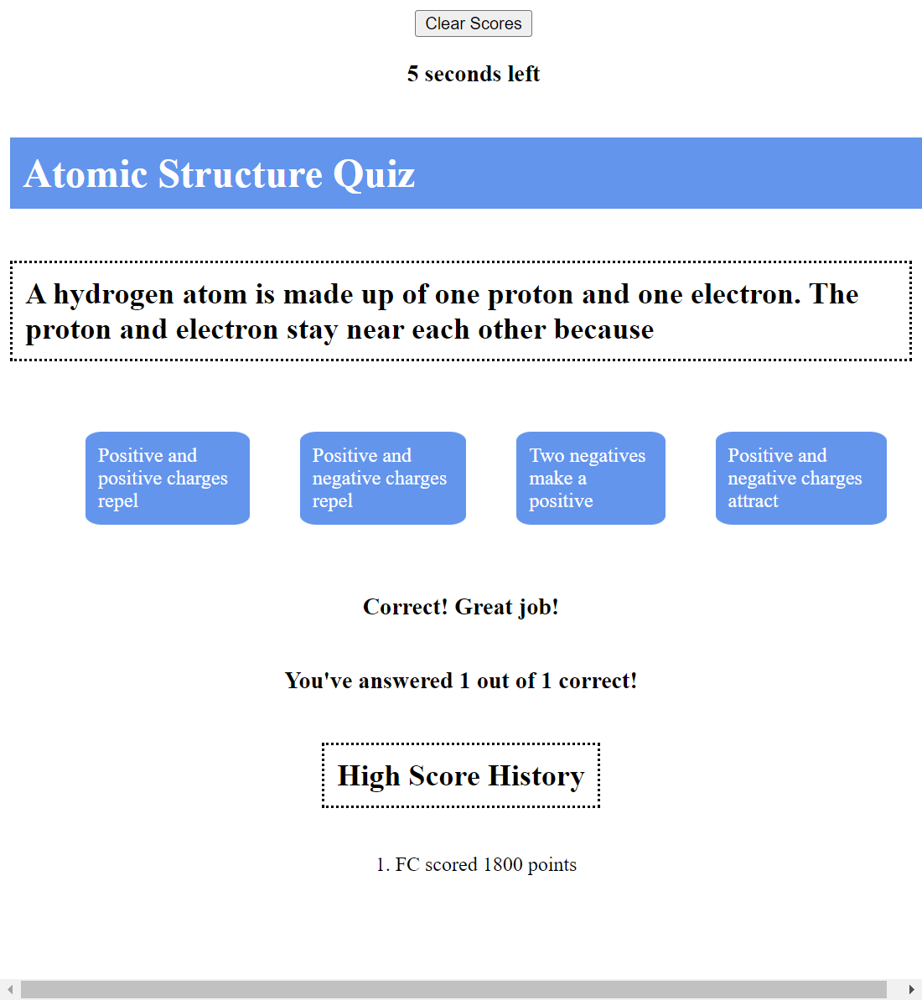

# QuizGame (Challenge #4)

## Description
This project is a quiz to test students on their understanding of atomic structure. The program currently has 8 questions, which generate at random - and has the user timed at 1 minute. Once the timer or the questions run out, the user is prompted to key in their initials and their favorite element. Their score is calculated using both time left and correct answers as metrics. High scores are stored and can be displayed based on user preference. 

## Usage
AS A USER I want to make sure my students understand atomic structure. This program allows them to answer questions, which have been randomized in order and in their answer options. Initials, score, and the users favorite element are stored (the latter property for a future use). 
 <a href="https://goldengayle.github.io/QuizGame/"> Quiz Game</a>
 

## Installation
N/A

## Credits
All code and images @goldengayle

## License
MIT License
Copyright (c) 2023 goldengayle
Permission is hereby granted, free of charge, to any person obtaining a copy of this software and associated documentation files (the "Software"), to deal in the Software without restriction, including without limitation the rights to use, copy, modify, merge, publish, distribute, sublicense, and/or sell copies of the Software, and to permit persons to whom the Software is furnished to do so, subject to the following conditions:
The above copyright notice and this permission notice shall be included in all copies or substantial portions of the Software.
THE SOFTWARE IS PROVIDED "AS IS", WITHOUT WARRANTY OF ANY KIND, EXPRESS OR IMPLIED, INCLUDING BUT NOT LIMITED TO THE WARRANTIES OF MERCHANTABILITY, FITNESS FOR A PARTICULAR PURPOSE AND NONINFRINGEMENT. IN NO EVENT SHALL THE AUTHORS OR COPYRIGHT HOLDERS BE LIABLE FOR ANY CLAIM, DAMAGES OR OTHER LIABILITY, WHETHER IN AN ACTION OF CONTRACT, TORT OR OTHERWISE, ARISING FROM, OUT OF OR IN CONNECTION WITH THE SOFTWARE OR THE USE OR OTHER DEALINGS IN THE SOFTWARE.
